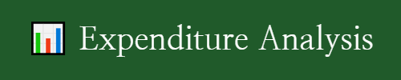

___
## Introduction
This is a web application that allows users to visualize their spending based on categories that they set up. The application enables users to add their expenditure into the specified categories, which helps to track their spending over time.

The expenditures can either be added manually or be uploaded via transaction statement file (Currently only support Handelsbanken). With file upload the user's expenditures will be automatically categorized based on the information contained in the text. 

In the data visualization section oof the application, the user can visualize their spending based on a selected date range. The visualization allows the user to visualize their surplus deficits within each month, as well as seeing the spending for each category over months, or years.

#### Example of surplus / deficit visualization
[visualization.webm](https://user-images.githubusercontent.com/58913762/226142185-94f38c07-0a31-4196-874c-81b9a7513b74.webm)

#### Example of visualization of category based spending
[upload_data.webm](https://user-images.githubusercontent.com/58913762/226142187-cfb75716-a53e-4501-b529-3f47277fdec1.webm)


## Features
* Users can create custom categories for their expenses
* Users can add expenses to their chosen categories
* The expenses can either be added manually or uploaded via file
    * If it's uploaded via file then the expenses will be categorized automatically
* The application automatically generates charts and graphs that show spending trends by category over time
* Users can filter the charts and graphs by date range or specific categories


## Technology Used
* Python - Streamlit for the frontend
* Python - sqlalchemy for the backend
* Postgresql for the database
* Python - Plotly and Pandas for generating graphs and charts
* Docker - For containerization of the application

## Installation
*Note* : If you want to run it locally you will need to have:
* Python installed on your system
* Some DBMS installed on your system / or use cloud based DBMS

Given that the requirements above are fulfilled, the web application can be retrieved using Git:


```bash
# Cloning the repo
$ git clone https://github.com/dolkt/expenditure_analysis.git

#Going to the the project's directory
$ cd expenditure_analysis

#Installing dependencies
$ pip install -r requirements.txt
```
In order to connect to your own database you can:
* Set up .env file at the project's root containing db_url=<your_url> (*Recommended*) 
* Replace the connecting string in database.py -> engine = create_engine(url=<your_url>)

To start the web application:

```bash
streamlit run Home.py
```
