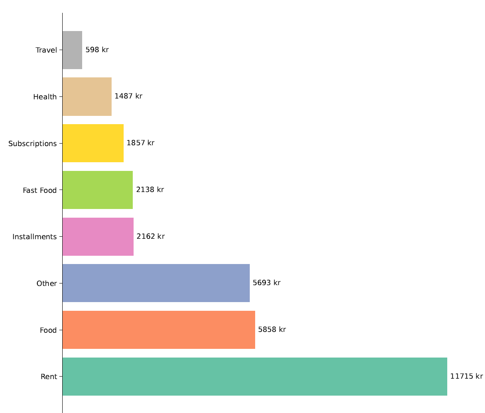
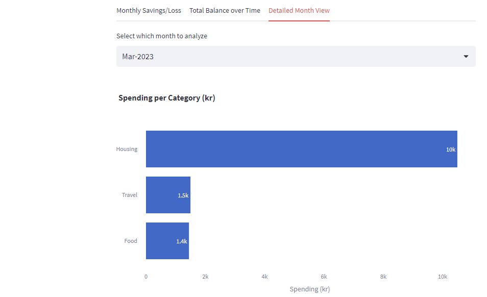
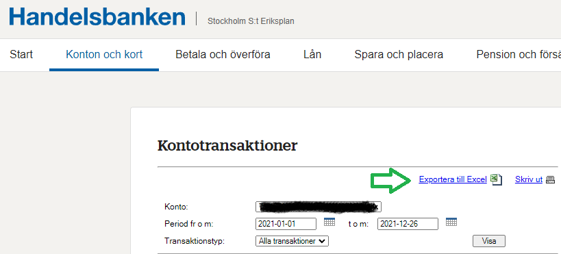
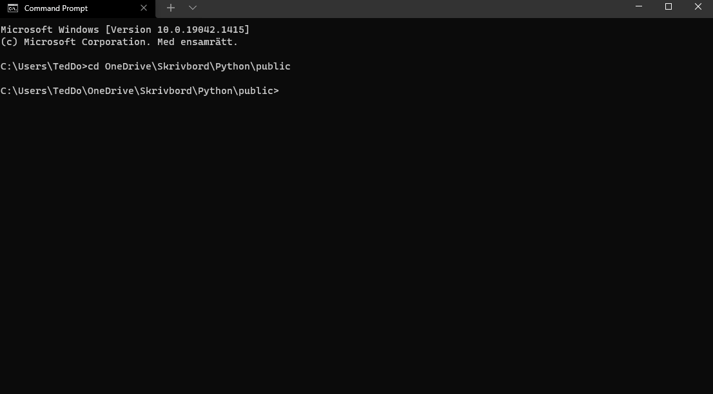
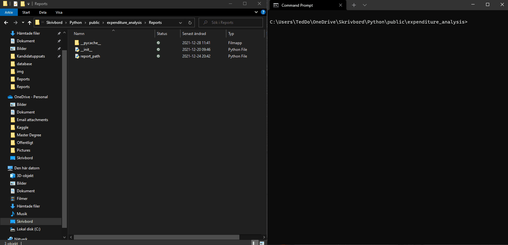

___
## 1. Introduction
Expenditure Analysis is a Python library for dealing with categorization of transaction data from Handelsbanken.

The library has **two** functionalities

1. Takes a transactionfile from Handelsbanken, cleans the data and places each transaction into a predefined category based on the textual data of the transaction. It then uploads the cleaned and categorized data to a local sqlite database.
2. Produces a Expenditure Report for a given time interval.

The Expenditure Report can either be visualized on a one-month basis or as a quarter-by-quarter report for a given time interval.

The purpose of Expenditure Analysis is to give the Handelsbanken user a better understanding of their expenditures. This understanding can be used to identify unwanted spending patterns, i.e if the user spends too much money on fast food.

The categorized costs can be tracked over time with the monthly and quarterly report in order to see if the user is able to successfully change their previously (unwanted) spending patterns.

#### Example of Monthly Expenditure Report:
 

#### Example of Quarterly Expenditure Report:


The "*Quarterly Expenditure Report*" will divide all your cost categories into three quartiles (*High*, *Medium* and *Low*). The *High* category contains the cost categories with the highest amount spent for the given time period.

## 2. Main Packages Used
* Pandas - For data cleaning and manipulation.
* Numpy - For data cleaning and manipulation.
* Regex - For handling textual patterns in the data.
* sqlite3 - For storing the data in a local database.
* Matplotlib - For data visualization.
* PdfPages - Each Expenditure Report will be stored in a pdf.


## 3. Installation
The program can be installed using Git


```bash
# Cloning the repo
$ git clone https://github.com/dolkt/expenditure_analysis.git

#Going to the the project's directory
$ cd Expenditures

#Installing dependencies
$ pip install -r requirements.txt
```

## 4. How To Use
In order to do any data visualization with the Expenditure Report functionality there has to be any underlying data. Therefore, the user must import their transaction file as a first step.

### 4.1 Downloading Transaction File
While logged in the file is retrievable from Handelsbanken here:



Download the .csv and place it in the following project folder:

``` 
.\Expenditures\files
```

### 4.2 Upload the transaction file
Via command line:
```bash
#Go to the Expenditures directory
cd Expenditures

#Execute the running script
python run.py
```

* Choose "*Upload new data*" by pressing num key 1, as informed by the prompt.
* All eligible transaction files will be listed. Choose which file to upload to the internal database by pressing the numeric key for the file you want to upload, as informed by the prompt.



### 4.3 Producing Expenditure Report
Via command line:
```bash
#Go to the Expenditures directory
cd Expenditures

#Execute the running script
python run.py
```

* Choose "*Produce Expenditure Report*" by pressing num key 2, as informed by the prompt.
* Choose which report you want. "*One-Month Report*" or "*Quarterly Report*".
* The report will be placed as a .pdf in the folder:
```
.\Expenditures\Reports
```


## 5.0 User Configuration
The user can configure their own categories and the belonging transaction text.
These categories can later on be seen in the produced "*Expenditure Report*"

The dictionary used to define the categories has the **keys** as the cost categories and the responding **values** as the transaction text that will be matched to that category.

Taken from the file:
```python
#Source
.\Expenditures\utils\manipulation.py

categories = {"Rent":["ga fastighet", "stenbackahus", "överf internet"],
                "Subscriptions":["hbo", "netflix", "rewell", "medium", "saga motion", "whoop", "disney"],
                "Food":["coop", "ica", "willys"],
                "Fast Food":["uber \*eats", "foodora", "subway", "mcdonalds"],
                "Travel":["sl", "ab storstockho", "ul kollektivtr", "uber \*trip", "taxi"],
                "Clothes":["massimo", "nk", "ahlens", "nk", "zalando"],
                "Health":["apotek"],
                "Installments": ["centrala"]}
```